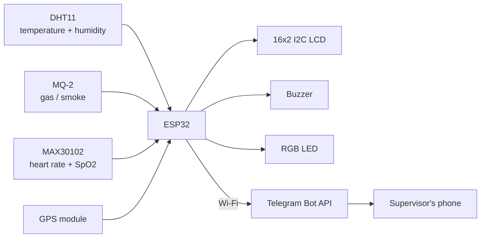

# LOCO Hazard Detection Helmet

[](https://github.com/navinkarthik-R/LOCO-HAZARD-DETECTION-HELMET/actions/workflows/ci.yml)
[](LICENSE)

An ESP32-based wearable safety-helmet prototype. It monitors the surrounding environment
(**temperature, humidity, combustible gas / smoke**) and the wearer's vitals (**heart rate,
blood oxygen / SpO2**), shows live readings and GPS status on an LCD, raises a local
buzzer + LED alarm on a threshold breach, and sends a **Telegram alert with the hazard type,
the readings and the wearer's GPS location**.


> **Status: prototype.** Not field-tested, not safety-certified, **not a medical device**.
> Do not rely on it for real hazard protection or health monitoring. The gas and vitals
> firmware has only been run in a PC simulation, not yet on real MQ-2 / MAX30102 hardware -
> see [Limitations](#limitations).

## Features

- Temperature and humidity sensing (DHT11)
- Combustible gas / smoke detection (MQ-2), relative to a clean-air baseline
- Wearer heart rate and SpO2 monitoring (MAX30102)
- 16x2 I2C LCD cycling through temperature/humidity, gas, vitals and GPS status
- Local alarm: buzzer + RGB status LED (red hazard / green normal / blue sensor error)
- GPS tracking (NEO-6M-class UART module) via TinyGPSPlus
- Telegram Bot alerts over Wi-Fi: hazard type, readings, Google Maps link and location pin
- Local alarms keep working with no Wi-Fi; alerts are queued and retried

## How it works



Three independent alarms, any of which makes the helmet go red:

| Alarm | Trips when | Clears when |
|---|---|---|
| **Heat/humidity** | temperature > 30 C **or** humidity > 70 % (defaults) | both are at least 1 degree / 1 % below the limits |
| **Gas / smoke** | MQ-2 reading > clean-air baseline + 500 counts, or >= 3000 counts | reading falls 100 counts below the trip level |
| **Wearer vitals** | SpO2 < 90 %, or heart rate < 45 or > 140 bpm, for **3 valid readings in a row** | 3 valid readings in a row comfortably back in range |

When an alarm trips the buzzer sounds for 15 seconds, the LCD shows `!! HAZARD !!` with the
cause, and a Telegram message goes out, for example:

```
HAZARD DETECTED
Gas/smoke: sensor reading 1400 (clean-air baseline 800, alarm level 1300)
Location: https://maps.google.com/?q=12.971600,77.594600
```

- While a hazard continues it re-alerts every 5 minutes instead of spamming, and a **new**
  cause appearing while another is active alerts immediately.
- Hysteresis (and the 3-in-a-row rule for vitals) stops readings that hover at a limit, or
  a single motion-corrupted pulse reading, from flapping the alarm.
- **Local alarms never depend on Wi-Fi.** If the network is down the buzzer, LED and LCD
  still work, and the alert is retried every 10 seconds until it gets through.
- Nothing blocks: GPS, the pulse oximeter and the gas sensor are all polled continuously,
  unlike a `delay()`-based loop that drops data while it sleeps.

## Hardware

| Component | Qty | Notes |
|---|---|---|
| ESP32 dev board | 1 | Arduino framework, 3.3 V logic, Wi-Fi |
| DHT11 temperature/humidity sensor | 1 | Module or bare sensor |
| MQ-2 gas sensor module | 1 | Heater needs 5 V. **AO must go through a voltage divider** (ESP32 ADC max 3.3 V) |
| MAX30102 heart-rate / SpO2 sensor | 1 | I2C, address `0x57`. Needs steady skin contact |
| GPS module with ceramic antenna (UART, 9600 baud) | 1 | NEO-6M-style. Needs open sky for a fix |
| 16x2 LCD with I2C backpack | 1 | Address `0x27` (or `0x3F`) |
| Active buzzer | 1 | |
| RGB LED (common cathode) + 3 x 220 ohm resistors | 1 | |
| 2 resistors for the MQ-2 divider | 2 | 10 kohm + 20 kohm |
| Breadboard, jumper wires, USB power bank | - | |
| Safety helmet | 1 | Mounting platform. The MAX30102 needs a padded mount against the skin |

| Function | ESP32 GPIO |
|---|---|
| GPS TX -> ESP32 RX / GPS RX -> ESP32 TX | 16 / 17 |
| DHT11 data | 4 |
| MQ-2 analog out (AO), **via divider** | 34 (ADC1) |
| Buzzer | 19 |
| RGB LED (R, G, B) | 25, 26, 27 |
| I2C SDA, SCL (LCD **and** MAX30102) | 21, 22 |

**Full wiring, the MQ-2 divider, MAX30102 mounting and an I2C voltage warning:
[docs/WIRING.md](docs/WIRING.md).** Read it before powering up: the LCD backpack's 5 V
pull-ups on a bus shared with the 3.3 V MAX30102 are a real concern.

> **Coming from the first prototype sketch?** It had the RGB LED on GPIO 21/22/23, which
> collides with the I2C pins. Move the three LED wires to 25/26/27.

## Quick start

### 1. Install the tools

1. [Arduino IDE](https://www.arduino.cc/en/software) 2.x.
2. ESP32 board support: *File -> Preferences -> Additional boards manager URLs*, add
   `https://espressif.github.io/arduino-esp32/package_esp32_index.json`, then *Tools -> Board
   -> Boards Manager* and install **esp32 by Espressif Systems**.
3. Libraries (*Tools -> Manage Libraries*):
   - **DHT sensor library** (Adafruit) and **Adafruit Unified Sensor**
   - **TinyGPSPlus** (Mikal Hart)
   - **LiquidCrystal I2C** (Frank de Brabander)
   - **SparkFun MAX3010x Pulse and Proximity Sensor Library** (supports the MAX30102)

### 2. Set up Telegram

1. In Telegram, open **@BotFather**, send `/newbot`, follow the prompts, and copy the **bot token**.
2. Open a chat with your new bot and press **Start** (a bot cannot message you first).
   For a group alert, add the bot to the group and send a message there.
3. In a browser open `https://api.telegram.org/bot<YOUR_TOKEN>/getUpdates` and find
   `"chat":{"id": ... }`. That number is your **chat ID** (group IDs are negative).

### 3. Add your credentials

```bash
cd firmware/loco_hazard_helmet
cp secrets.h.example secrets.h
```

Edit `secrets.h` with your Wi-Fi name and password (2.4 GHz only) and the Telegram token and
chat ID. `secrets.h` is git-ignored. **Never commit real credentials.**

### 4. Flash

1. Open `firmware/loco_hazard_helmet/loco_hazard_helmet.ino` in the Arduino IDE.
2. *Tools -> Board -> ESP32 Dev Module* and pick your serial port.
3. **Power the helmet on in clean air** (the MQ-2 takes its baseline during start-up).
4. Upload. If it hangs on "Connecting...", hold the board's **BOOT** button until upload starts.
5. Open the Serial Monitor at **115200 baud** to watch readings and Telegram results.

### 5. What you should see

| Moment | What happens |
|---|---|
| Power on | LED cycles red, green, blue; buzzer chirps once; LCD shows `LOCO Helmet` |
| First 2 minutes | LCD gas page shows `Gas: warming up` with a countdown; no gas alarm yet |
| Normal | Green LED. LCD rotates every 3 s: temperature/humidity, gas, SpO2/HR, GPS |
| Hazard | Red LED, buzzer for 15 s, LCD `!! HAZARD !!` plus the cause, Telegram message |
| DHT unplugged | Blue LED, LCD `Sensor Error` |
| MAX30102 missing | LCD `SpO2: no sensor`; everything else still works |
| Sensor not touching skin | LCD `SpO2/HR: -- / No contact` |
| GPS wiring wrong | LCD `GPS: No Data / Check wiring` |

## Configuration

Everything you are likely to change is at the top of
[`loco_hazard_helmet.ino`](firmware/loco_hazard_helmet/loco_hazard_helmet.ino).

| Setting | Default | Meaning |
|---|---|---|
| `THRESHOLDS` | 30 C, 70 %, hysteresis 1.0 | Heat/humidity limits. **30 C is below normal summer temperature in many places - set limits for your environment.** |
| `GAS_LIMITS` | delta 500, absolute 3000, hysteresis 100 | MQ-2 limits in raw ADC counts. **Placeholders - calibrate (below).** |
| `VITALS_LIMITS` | SpO2 90, HR 45-140, hysteresis 2, confirm 3 | Wearer-vitals limits. **Placeholders, not medical advice.** |
| `GAS_WARMUP_MS` | 120000 | No gas alarm for this long after boot; the last 10 s set the baseline |
| `MAX_LED_POWER` | 60 | MAX30102 LED current; raise it for forehead/temple use |
| `CONTACT_IR_MIN` | 50000 | IR level below which "no skin contact" is assumed; lower it if a forehead mount reads low |
| `VITALS_STALE_MS` | 30000 | No valid vitals for this long drops a latched vitals alarm |
| `BUZZER_ON_MS` | 15 s | Buzzer duration per alert |
| `ALERT_REPEAT_MS` | 5 min | Re-alert interval while a hazard persists |
| `ALERT_RETRY_MS` | 10 s | Retry interval after a failed send |
| `LCD_ADDR` | `0x27` | I2C address of the LCD |
| `LED_COMMON_ANODE` | `false` | Set `true` for a common-anode LED |
| `*_PIN` | see the pin table | Match your wiring |

### Calibrating the gas sensor

An MQ-2 is **non-selective** (LPG, smoke, CO, hydrogen, alcohol and more all move it), its
output depends on temperature and humidity, and the ESP32 ADC is non-linear. A raw count
is "something is in the air", not a ppm reading. To make the alarm meaningful:

1. Power on in clean air and let the 2-minute warm-up finish. The Serial Monitor prints
   `Gas baseline N, alarm level M`.
2. Watch the reading on the LCD gas page for a few minutes to see how much it wanders.
3. In a **ventilated area, away from ignition sources**, briefly expose the sensor to your
   target (for example smoke from a just-extinguished match held at a distance). Note how far
   the count rises.
4. Set `deltaRaw` comfortably above the normal wander and comfortably below that rise, and
   re-flash. If a new MQ-2 gives unstable readings, give it a long burn-in first (see its
   datasheet).
5. If you can, compare against a reference detector. This project has not been calibrated
   against one.

### Vitals notes

The MAX30102 uses SparkFun's Maxim SpO2 algorithm over a 4-second window, refreshed every
second. A reading is only used if the algorithm marks it valid and it is physiologically
plausible (SpO2 70-100 %, 30-220 bpm). On a helmet, sensor contact and movement dominate
the error - treat the numbers as **indicative only**.

## Testing it

**Bench test without waiting for a real hazard:**
- *Heat/humidity:* temporarily set `THRESHOLDS` just under the room reading (room 28 C -> limit
  27) and upload. Breathing on the DHT11 also pushes humidity up quickly.
- *Gas:* after warm-up, hold smoke from a just-extinguished match near the MQ-2 (ventilated
  area, nothing flammable nearby).
- *Vitals:* press a fingertip firmly and still on the MAX30102. After about 5 seconds the LCD
  shows SpO2 and HR. To test the alarm, temporarily raise `spo2Min` above your reading.
- Set limits back afterwards.

**GPS:** take it outside with the antenna facing open sky. The first fix after power-on can
take anywhere from under a minute to several minutes. Indoors, `GPS: No Signal` (as in the
photo above) is normal. `GPS: No Data` is different: *nothing* is arriving from the module,
so check the TX/RX cross-over and power.

**Automated tests** (no hardware needed, run on any PC with `g++`):

```bash
# Hazard logic: thresholds, hysteresis, gas, vitals confirmation, URL encoding, alert text
g++ -std=c++17 -Wall -Wextra -Werror test/test_logic.cpp -o /tmp/test_logic && /tmp/test_logic

# The real firmware sketch against a fake clock, sensors and network
g++ -std=gnu++17 -Wall -Wextra -Werror -x c++ -I test/sim/stubs \
    -I firmware/loco_hazard_helmet test/sim/sim.cpp -o /tmp/simbin
/tmp/simbin          # full scenario run
/tmp/simbin nomax    # MAX30102 missing at boot
```

The simulation checks: gas ignored during warm-up, each alarm and its alert text, no spam
while a hazard persists, a repeat after 5 minutes, buzzer timing, hysteresis, a new cause
alerting immediately, retries after failed sends, local alarms and later delivery when Wi-Fi
is down, a vitals alarm needing 3 consecutive bad readings and dropping when the sensor is
removed, the oximeter window restarting after a blocking send, and sensor-failure handling.
CI also compiles the sketch for the ESP32 on every push. **These tests prove the logic and
timing, not the physical sensors** - that still needs bench work.

## Troubleshooting

| Symptom | Likely cause |
|---|---|
| LCD backlight on, no text | Wrong I2C address (try `0x3F`) or the contrast screw on the backpack needs turning |
| LCD completely dark | Backpack not powered, or SDA/SCL swapped |
| `Sensor Error` | DHT11 data pin not on GPIO 4, no power, or missing pull-up on a bare sensor |
| `Gas: warming up` for ever | Board is resetting repeatedly (brown-out): use a better cable/power bank |
| Gas reading stuck near 0 or 4095 | AO not connected, divider missing/wrong, or the sensor is unpowered (needs 5 V) |
| Gas alarm fires constantly | `deltaRaw` too small for the sensor's wander, or the helmet was powered on in smoky air |
| `SpO2: no sensor` | MAX30102 not found at `0x57`: check SDA/SCL, 3.3 V power, soldering |
| `No contact` with a finger on it | Press more firmly, block ambient light, or lower `CONTACT_IR_MIN` |
| SpO2/HR never settle | Movement, cold or dry skin, or too little LED power (raise `MAX_LED_POWER`) |
| `GPS: No Data` | GPS TX/RX not crossed, GPS unpowered, or not 9600 baud |
| `GPS: No Signal` | Normal indoors; go outside and wait |
| No Telegram message, Serial shows `HTTP -1` | Wi-Fi not connected / no internet |
| Serial shows `HTTP 400`, `401` or `404` | Wrong chat ID or bot token; press Start in the bot chat |
| One LED colour never lights | That channel is miswired, or the LED is common-anode |

## Security notes

- **Never commit `secrets.h`.** Anyone with the bot token can send messages as your bot. If it
  leaks, send `/revoke` to @BotFather to get a new one.
- The Telegram connection is encrypted, but the firmware calls `client.setInsecure()`, so the
  server certificate is **not verified**. That keeps setup simple but leaves room for a
  man-in-the-middle on a hostile network. To harden it, replace that call with
  `client.setCACert(...)` using the root certificate of `api.telegram.org`'s chain.
- The bot token is part of the request URL. The firmware never prints it, but don't add
  logging that does.
- Alert messages contain the wearer's location and, for a vitals alarm, health readings. Only
  send them to a chat you control and trust.

## Limitations

- **Not for explosive atmospheres.** This is a hobby circuit, not an intrinsically safe or
  gas-certified instrument. Do not rely on it where flammable gas could ignite.
- **MQ-2 is non-selective and uncalibrated by default.** It responds to LPG, smoke, CO,
  hydrogen, alcohol and more, so a count is a "something is in the air" flag, not a ppm
  reading. It drifts with temperature, humidity and age, needs a long first burn-in plus a
  warm-up each time, and the ESP32 ADC is non-linear. ADC2 pins don't work while Wi-Fi is on,
  so the analog input must stay on an ADC1 pin.
- **MAX30102 SpO2 on a helmet is unreliable.** It needs steady skin contact (finger, forehead
  or temple), and motion artefacts are severe on a moving worker. The vitals limits are
  placeholders, this is not a medical device, and the readings have not been validated
  against a reference pulse oximeter.
- **The DHT11 is a low-cost sensor** (datasheet typically quotes around +/-2 C and +/-5 %RH)
  and responds slowly.
- **GPS needs a clear view of the sky**; it will not report indoors or in tunnels.
- Alerts need **2.4 GHz Wi-Fi in range**. There is no cellular fallback. Telegram delivery is
  best-effort; the helmet retries but cannot guarantee anyone sees it.
- Sending an alert takes a few seconds, during which GPS data may be missed and the pulse
  oximeter restarts its measurement; both catch up right after.
- **Gas and vitals support has only been run in a PC simulation**, not yet on real MQ-2 and
  MAX30102 hardware.

## What changed from the first prototype sketch

The original sketch had these problems, all fixed in this firmware:

- The RGB LED never lit (`ledcWrite()` with no LEDC setup).
- The LED pins (21/22) collided with the I2C bus. They are now 25/26/27.
- Blocking `delay()` calls starved the GPS UART and would have wrecked pulse-oximeter sampling.
- Telegram only got a location pin on GPS updates, never a hazard alert, and the message
  counter never reset so only two messages ever went out.
- A failed Wi-Fi connection rebooted the board in a loop; it now carries on offline.
- `setRGBColor()` was used before it was defined (PlatformIO build failure).

## Roadmap

- [x] Fix the LED/I2C pin conflict and LED control
- [x] Replace `delay()` with non-blocking `millis()` scheduling
- [x] Send a Telegram text alert with hazard type, readings and location
- [x] Reset and rate-limit alert messages sensibly
- [x] Add MQ-2 gas and MAX30102 SpO2/heart-rate support
- [ ] Test the gas and vitals code on real hardware
- [ ] Calibrate the MQ-2 against a known reference and set defensible gas thresholds
- [ ] Validate MAX30102 readings against a reference pulse oximeter
- [ ] Add GSM/LoRa fallback for areas without Wi-Fi
- [ ] Move from breadboard to a soldered PCB with an enclosure

## Repository layout

```
.
├── firmware/loco_hazard_helmet/
│   ├── loco_hazard_helmet.ino   main sketch
│   ├── hazard_logic.h           pure logic (thresholds, gas, vitals, URL encoding, alert text)
│   └── secrets.h.example        copy to secrets.h and fill in
├── docs/
│   ├── WIRING.md                pin table, MQ-2 divider, MAX30102 mounting, I2C voltage
│   └── images/prototype.jpg
├── test/
│   ├── test_logic.cpp           unit tests for hazard_logic.h
│   └── sim/                     whole-sketch simulation + fake Arduino libraries
├── .github/workflows/ci.yml     tests + ESP32 compile on every push
├── LICENSE
└── README.md
```

## Team

<!-- Add names and roles -->

## License

MIT (see [LICENSE](LICENSE)). Change this if your institution or hackathon requires otherwise.
