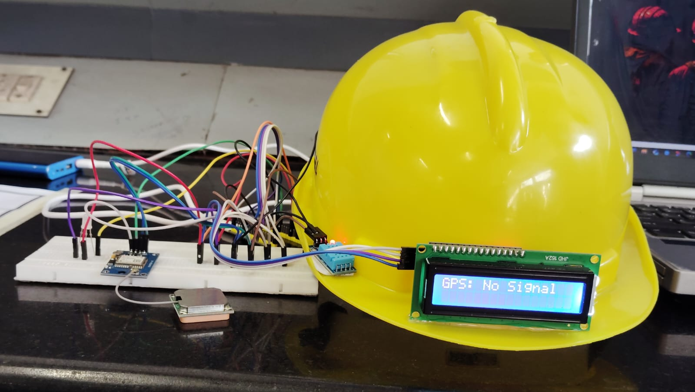
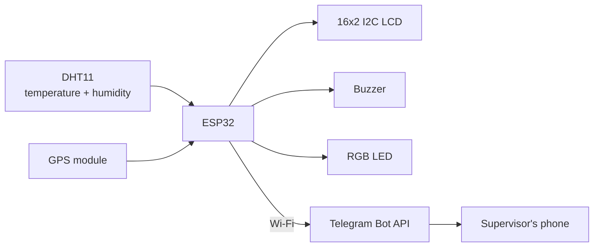

# LOCO Hazard Detection Helmet

[](https://github.com/navinkarthik-R/LOCO-HAZARD-DETECTION-HELMET/actions/workflows/ci.yml)
[](LICENSE)

A smart safety-helmet prototype built on an **ESP32**. It watches the temperature and
humidity around the wearer, shows live status on a small LCD, sounds a buzzer and turns an
LED red when conditions pass a limit, and sends a **Telegram alert with the wearer's GPS
location** so someone else knows where the problem is.



> **Prototype / educational project - not a certified safety device.** Do not rely on it
> to protect anyone. See [Limitations](#limitations).

## How it works



- Every 2 seconds the helmet reads the DHT11.
- If temperature **or** humidity goes above its limit, the helmet enters **hazard** state:
  buzzer on for 15 seconds, LED red, LCD shows `!! HAZARD !!`, and a Telegram message is sent
  with the readings and a Google Maps link (plus a map pin, once the GPS has a fix).
- While the hazard continues it re-alerts every 5 minutes instead of spamming.
- The alarm uses **hysteresis**: it only clears when readings are 1 degree / 1 % below the
  limit, so a reading hovering at the limit does not flip the alarm on and off.
- **Local alarms never depend on Wi-Fi.** If the network is down the buzzer, LED and LCD still
  work, and the alert is retried every 10 seconds until it gets through.
- Nothing blocks: the GPS stream is read continuously, unlike a `delay()`-based loop that
  drops GPS data while it sleeps.

## Hardware

| Part | Notes |
|---|---|
| ESP32 DevKit | 3.3 V logic, Wi-Fi |
| GPS module | UART, 9600 baud, NEO-6M-style, with antenna |
| DHT11 | Temperature + humidity sensor (module or bare sensor) |
| 16x2 LCD with I2C backpack | Address `0x27` (or `0x3F`) |
| Active buzzer | |
| RGB LED + 3 x 220 ohm resistors | Common-cathode by default |
| Breadboard, jumper wires | |
| USB power bank | Powers the ESP32 |
| Helmet | Mount the LCD where it is visible |

Full pin table and notes: **[docs/WIRING.md](docs/WIRING.md)**

| Part | GPIO |
|---|---|
| GPS TX -> ESP32 RX / GPS RX -> ESP32 TX | 16 / 17 |
| DHT11 data | 4 |
| Buzzer | 19 |
| RGB LED (R, G, B) | 25, 26, 27 |
| LCD SDA, SCL | 21, 22 |

> **Coming from the first prototype sketch?** It had the RGB LED on GPIO 21/22/23, which
> collides with the LCD's I2C pins. Move the three LED wires to 25/26/27. Details in
> [docs/WIRING.md](docs/WIRING.md#important-the-rgb-led-pins-changed).

## Quick start

### 1. Install the tools

1. [Arduino IDE](https://www.arduino.cc/en/software) 2.x.
2. ESP32 board support: *File -> Preferences -> Additional boards manager URLs*, add
   `https://espressif.github.io/arduino-esp32/package_esp32_index.json`, then *Tools -> Board
   -> Boards Manager* and install **esp32 by Espressif Systems**.
3. Libraries (*Tools -> Manage Libraries*):
   - **DHT sensor library** (Adafruit) and **Adafruit Unified Sensor**
   - **TinyGPSPlus** (Mikal Hart)
   - **LiquidCrystal I2C** (Frank de Brabander)

### 2. Set up Telegram

1. In Telegram, open **@BotFather**, send `/newbot`, follow the prompts, and copy the **bot token**.
2. Open a chat with your new bot and press **Start** (a bot cannot message you first).
   For a group alert, add the bot to the group and send a message there.
3. In a browser open `https://api.telegram.org/bot<YOUR_TOKEN>/getUpdates` and find
   `"chat":{"id": ... }`. That number is your **chat ID** (group IDs are negative).

### 3. Add your credentials

```bash
cd firmware/loco_hazard_helmet
cp secrets.h.example secrets.h
```

Edit `secrets.h` with your Wi-Fi name and password (2.4 GHz only) and the Telegram token and
chat ID. `secrets.h` is git-ignored - keep it that way.

### 4. Flash

1. Open `firmware/loco_hazard_helmet/loco_hazard_helmet.ino` in the Arduino IDE.
2. *Tools -> Board -> ESP32 Dev Module* and pick your serial port.
3. Upload. If it hangs on "Connecting...", hold the board's **BOOT** button until upload starts.
4. Open the Serial Monitor at **115200 baud** to watch readings and Telegram results.

### 5. What you should see

| Moment | What happens |
|---|---|
| Power on | LED cycles red, green, blue; buzzer chirps once; LCD shows `LOCO Helmet` |
| Normal | Green LED. LCD alternates between temperature/humidity and GPS status every 3 s |
| Hazard | Red LED, buzzer for 15 s, LCD `!! HAZARD !!`, Telegram message |
| Sensor unplugged | Blue LED, LCD `Sensor Error` |
| GPS wiring wrong | LCD `GPS: No Data / Check wiring` |

## Configuration

Everything you are likely to change is at the top of
[`loco_hazard_helmet.ino`](firmware/loco_hazard_helmet/loco_hazard_helmet.ino).

| Setting | Default | Meaning |
|---|---|---|
| `THRESHOLDS` | 30 C, 70 %, 1.0 hysteresis | Hazard limits. **30 C is below normal summer temperature in many places - set limits for your environment.** |
| `BUZZER_ON_MS` | 15 s | Buzzer duration per alert |
| `ALERT_REPEAT_MS` | 5 min | Re-alert interval while hazard persists |
| `ALERT_RETRY_MS` | 10 s | Retry interval after a failed send |
| `LCD_ADDR` | `0x27` | I2C address of the LCD |
| `LED_COMMON_ANODE` | `false` | Set `true` for a common-anode LED |
| `*_PIN` | see table above | Match your wiring |

## Testing it

**Bench test without waiting for a real hazard:** temporarily set `THRESHOLDS` just under
the current room reading (for example, room is 28 C, set the limit to 27) and upload. The
hazard should trigger within a couple of seconds. Gently breathing on the DHT11 pushes
humidity up quickly, too. Set the limits back afterwards.

**GPS:** take it outside with the antenna facing open sky. The first fix after power-on
can take anywhere from under a minute to several minutes. Indoors, `GPS: No Signal` (as in
the photo above) is normal. `GPS: No Data` is different: it means *nothing* is arriving from
the module, so check the TX/RX cross-over and power.

**Automated tests** (no hardware needed, run on any PC with `g++`):

```bash
# Hazard logic: thresholds, hysteresis, URL encoding, alert text
g++ -std=c++17 -Wall -Wextra -Werror test/test_logic.cpp -o /tmp/test_logic && /tmp/test_logic

# The real firmware sketch against a fake clock, sensor and network
g++ -std=gnu++17 -Wall -Wextra -Werror -x c++ -I test/sim/stubs \
    -I firmware/loco_hazard_helmet test/sim/sim.cpp -o /tmp/sim && /tmp/sim
```

The simulation checks: a single alert on hazard, no spam while it persists, a repeat after
5 minutes, buzzer timing, hysteresis, retry after failed sends, local alarms and later
delivery when Wi-Fi is down, and sensor-failure handling. CI also compiles the sketch for the
ESP32 on every push.

## Troubleshooting

| Symptom | Likely cause |
|---|---|
| LCD backlight on, no text | Wrong I2C address (try `0x3F`) or contrast screw on the backpack needs turning |
| LCD completely dark | Backpack not on 5 V, or SDA/SCL swapped |
| `Sensor Error` | DHT11 data pin not on GPIO 4, no power, or missing pull-up on a bare sensor |
| `GPS: No Data` | GPS TX/RX not crossed, GPS unpowered, or not 9600 baud |
| `GPS: No Signal` | Normal indoors; go outside and wait |
| No Telegram message, Serial shows `HTTP -1` | Wi-Fi not connected / no internet |
| Serial shows `HTTP 400` or `401` / `404` | Wrong chat ID, or wrong bot token; press Start in the bot chat |
| One LED colour never lights | That channel is miswired, or the LED is common-anode |

## Security notes

- **Never commit `secrets.h`.** Anyone with the bot token can send messages as your bot. If it
  leaks, send `/revoke` to @BotFather to get a new one.
- The Telegram connection is encrypted, but the firmware calls `client.setInsecure()`, so the
  server certificate is **not verified**. That keeps setup simple but leaves room for a
  man-in-the-middle on a hostile network. To harden it, replace that call with
  `client.setCACert(...)` using the root certificate of `api.telegram.org`'s chain.
- The bot token is part of the request URL. The firmware never prints it, but don't add
  logging that does.

## Limitations

- **It detects temperature and humidity only** - not gas, heat radiation, impact, or
  falls. A "hazard" here means those two readings passed your limits.
- **The DHT11 is a low-cost sensor** (datasheet typically quotes around +/-2 C and +/-5 %RH)
  and responds slowly. Do not use it for anything where precision matters.
- **GPS needs a clear view of the sky**; it will not report indoors or in tunnels.
- Alerts need **2.4 GHz Wi-Fi in range**. There is no cellular fallback.
- Telegram delivery is best-effort; the helmet retries but cannot guarantee someone sees it.
- Sending an alert takes a few seconds, during which GPS data may be missed; the position
  catches up right after.

## Ideas for later

- GSM/LTE module (for example SIM800L/A7670) for alerts without Wi-Fi
- Gas sensor (MQ-series) and accelerometer for fall/impact detection
- Replace the DHT11 with a more accurate sensor (DHT22, SHT31, BME280)
- Battery monitoring and a low-battery alert

## Repository layout

```
.
├── firmware/loco_hazard_helmet/
│   ├── loco_hazard_helmet.ino   main sketch
│   ├── hazard_logic.h           pure logic (thresholds, hysteresis, URL encoding, alert text)
│   └── secrets.h.example        copy to secrets.h and fill in
├── docs/
│   ├── WIRING.md                pin table, notes
│   └── images/prototype.jpg
├── test/
│   ├── test_logic.cpp           unit tests for hazard_logic.h
│   └── sim/                     whole-sketch simulation + fake Arduino libraries
├── .github/workflows/ci.yml     tests + ESP32 compile on every push
├── LICENSE
└── README.md
```

## License

[MIT](LICENSE)
